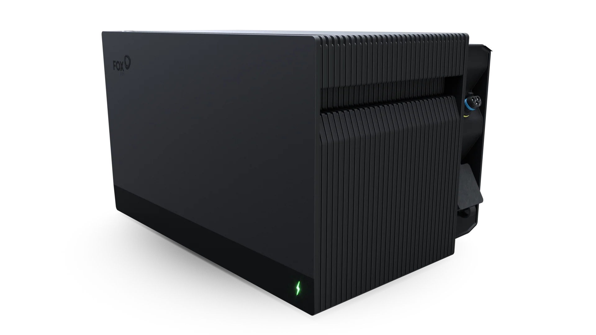
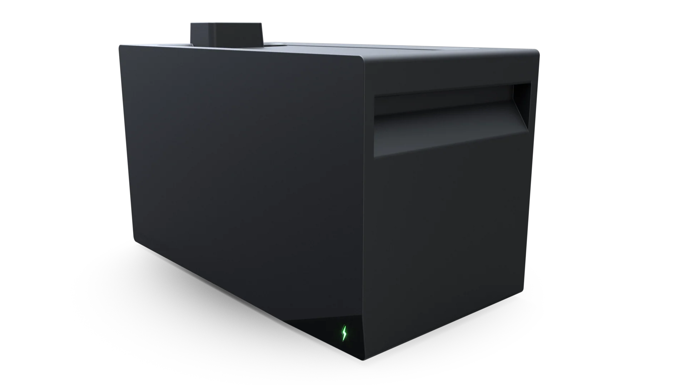

[![release][release-badge]][release-url]
![active][active-badge]
![downloads][downloads-badge]

[![hacs][hacs-badge]][hacs-url]
![license][lic-badge]
[![buymecoffeebadge]][buymecoffeeurl]

# Home Assistant NextEnergy Battery Modbus Integration

This is a custom integration for Home Assistant to monitor NextEnergy batteries via Modbus TCP.

The battery is a Fox ESS MQ2200-M-AC and the expansion batteries are Fox ESS MQ2200-M-S.

Implements Fox ESS Modbus registers from [`FoxESS Modbus Protocol--20250115 (V1.05.03.00)(1).pdf`](https://github.com/wimb0/home-assistant-nextenergy-battery-modbus/blob/main/FoxESS%20Modbus%20Protocol--20250115%20(V1.05.03.00)(1).pdf).

## Installation

1.  **HACS (Custom Repository):**
    * In Home Assistant, navigate to **HACS**.
    * Click the three dots menu (top right) and select **Custom repositories**.
    * Enter the repository URL: `https://github.com/wimb0/home-assistant-nextenergy-battery-modbus`.
    * Select **Integration** as the Category.
    * Click **ADD**.
    * Then, go to the **Integrations** section in HACS, search for **"NextEnergy Battery"** and install the integration.
2.  **Manual:** Copy the `custom_components/nextenergy_battery` directory to your Home Assistant `custom_components` directory.
3.  Restart Home Assistant.

## Configuration

1.  Go to **Settings** > **Devices & Services**.
2.  Click **+ Add Integration**.
3.  Search for "NextEnergy Battery" and select it.
4.  Enter the Host IP, Port, and Modbus Slave ID of your battery.
5.  (Optional) Enter a prefix for the sensor names. The default is `nextenergy`.

## Sensors

The integration creates a device with a number of sensors to monitor your battery system. The entity IDs of the sensors will be prefixed with the value you provided during configuration (e.g. `sensor.nextenergy_system_soc`). Many less-critical sensors are disabled by default but can be enabled from the device page.

#### Key Metrics
- **System SoC:** Overall State of Charge of the system.
- **BMS SoC:** State of Charge of the Battery Management System.
- **Battery Power:** Current power flow of the battery (positive is charging, negative is discharging).
- **Load Power:** Current power consumption of your house.
- **Grid Power (Meter):** Current power flow from/to the grid (positive is import, negative is export).

#### Derived Power Sensors
These sensors provide a more granular view of power flow.
- **Battery Charging**
- **Battery Discharging**
- **Grid Import**
- **Grid Export**

#### Energy Statistics
- **Load Consumption (Today/Total)**
- **Grid Export (Today/Total)**
- **Grid Import (Today/Total)**
- **Battery Charge (Today/Total)**
- **Battery Discharge (Today/Total)**

#### BMS & Inverter Details
- **BMS Voltage**
- **BMS Current**
- **BMS SOH** (State of Health)
- **BMS Ambient Temp**
- **Inverter Temp**
- **Grid Frequency**

#### Disabled by Default
The following sensors are disabled by default and can be enabled manually if needed:
- **Device Information:** Model Name, Serial Numbers, and all firmware versions.
- **BMS Slave Devices:** Version and Serial Number for all 5 slave slots.
- **Status Codes:** Raw status codes for the inverter, BMS, and meter.
- **Grid Phase Details:** Individual voltage and current for all three phases (R/S/T).
- **Power Ratings:** Rated Power, Max Active Power.
- **Other Power Metrics:** Reactive Power, EPS Power.

---

## Disclaimer

**This project is not endorsed by, directly affiliated with, maintained, authorized, or sponsored by NextEnergy.**

[hacs-url]: https://github.com/hacs/integration
[hacs-badge]: https://img.shields.io/badge/hacs-default-orange.svg?style=for-the-badge
[release-badge]: https://img.shields.io/github/v/release/wimb0/home-assistant-nextenergy-battery-modbus?style=for-the-badge
[downloads-badge]: https://img.shields.io/github/downloads/wimb0/home-assistant-nextenergy-battery-modbus/total?style=for-the-badge
[active-badge]: https://badge.t-haber.de/badge/nextenergy_battery?kill_cache=1
[lic-badge]: https://img.shields.io/github/license/wimb0/home-assistant-nextenergy-battery-modbus?style=for-the-badge
[buymecoffeeurl]: https://www.buymeacoffee.com/wimbo
[buymecoffeebadge]: https://img.shields.io/badge/buy%20me%20a%20coffee-donate-yellow.svg?style=for-the-badge
[home-assistant]: https://www.home-assistant.io/
[hacs]: https://hacs.xyz
[release-url]: https://github.com/wimb0/home-assistant-nextenergy-battery-modbus/releases
